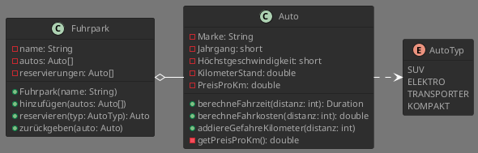

# Fuhrpark
## Design
### Klassendiagramm

```plantuml
@startuml
!theme reddress-darkblue
hide empty attribute
hide empty method
allowmixing

class Fuhrpark {
    -name: String
    -autos: Auto[]
    -reservierungen: Auto[]
    +Fuhrpark(name: String)
    +hinzufügen(autos: Auto[])
    +reservieren(typ: AutoTyp): Auto
    +zurückgeben(auto: Auto)
}

class Auto {
    -Marke: String
    -Jahrgang: short
    -Höchstgeschwindigkeit: short
    -KilometerStand: double
    -PreisProKm: double
    +berechneFahrzeit(distanz: int): Duration
    +berechneFahrkosten(distanz: int): double
    +addiereGefahreKilometer(distanz: int)
    -getPreisProKm(): double
}

enum AutoTyp {
    SUV
    ELEKTRO
    TRANSPORTER
    KOMPAKT
}

Fuhrpark o- Auto
Auto .> AutoTyp
@enduml
```
