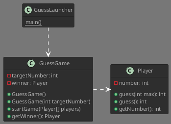

# Ratespiel

## Design

### Klassendiagramm

#### Klassen
##### Player
- number: Spielernummer

##### GuessGame
- targetNumber: Zielwert
- winner: Gewinner

#### Strategie

##### Version 1
`GuessGame` generiert eine Zufallszahl zwischen 1 und `MAX`. Diese Zahl wird dann von den `Player` durch Raten gesucht. Der **erste** Spieler, der die richtige Zahl erreicht, ist der Gewinner.

##### Version 2
Wir wollen etwas mehr informationen über das Spiel bekommen: Anzahl Versuche, zu erratende Zahl

##### Version 3
Wir implementieren eine `startGame` Methode, welcher wir die maximale Anzahl Versuche zurückgeben und als Resultat den Gewinner erhalten. Dieser kann `null` sein.

##### Version 4
Wir geben Rückmeldung, ob der erratene Wert kleiner (-1), gleich (0) oder grösser ist (1). Entsprechend passt der Spieler seinen Bereich an, in dem er ratet. Um das Spiel wieder interessanter zu machen, erhöhen wir den maximalen Bereich auf 1000.